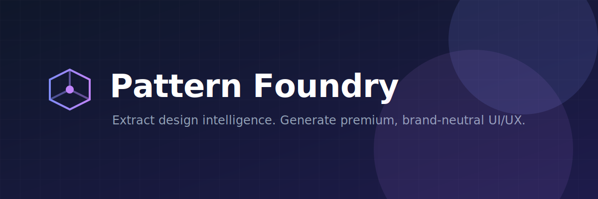
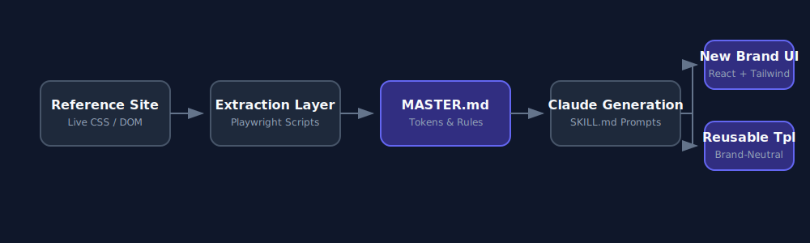
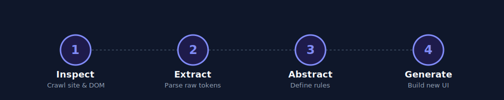

<div align="center">
  

  <br />

  <h1>Pattern Foundry</h1>

  <p>
    <strong>A Claude Code skill for extracting transferable UI/UX design DNA from a reference site and reusing it for original brands and templates.</strong>
  </p>

  <p>
    <a href="https://github.com/yutuknown/pattern-foundry/stargazers"></a>
    <a href="https://github.com/yutuknown/pattern-foundry/network/members"></a>
    <a href="https://github.com/yutuknown/pattern-foundry/releases"></a>
    <a href="LICENSE"></a>
  </p>
</div>

---

## Why this exists

Generative UI tools often produce generic "design mush" or clone reference sites too directly, leading to copyright and brand-safety issues. 

**Pattern Foundry solves this by separating brand identity from design quality.**

Instead of copying colors and logos, this skill extracts the *quality system*—spacing discipline, interaction physics, typography scaling, component grammar, and conversion architecture—and applies those structural rules to generate **original work** for entirely different brands, industries, and contexts.

## What it does

- **Extracts Visual DNA:** Reverses CSS rules into semantic design tokens.
- **Separates Identity from System:** Distinguishes between what is proprietary (logos, exact copy) and what is transferable (fluid typography, bimodal radii, trust signal sequencing).
- **Generates Reusable Systems:** Packages findings into a persisted `MASTER.md` design system.
- **Supports Original Generation:** Builds fresh, premium sites for new brands using the extracted intelligence.
- **Builds Reusable Templates:** Creates generic, blank-fill templates with premium structure built-in.

## Core features

<div align="center">
  
</div>

- **Prompt-first generation workflow:** Marketplace installs generate from bundled local references by default (no live crawling).
- **Design-system persistence:** Leverages `MASTER.md` for global rules and `pages/*.md` for precise, minimal overrides.
- **Brand adaptation rules:** Shifts temperature, density, and tone to fit new industries (B2B, Healthcare, Fintech, etc.).
- **Anti-copy guardrails:** Strictly enforces originality to prevent source-brand leakage.
- **Sample outputs:** React and Tailwind CSS scaffolding ready for production.
- **Helper scripts:** Python automation for extraction, design-system builds, and validations.

## Repo structure

```text
pattern-foundry/
├── .claude/skills/transferable-uiux-pattern-engine/   # Source-of-truth engine (edit here)
├── plugins/pattern-foundry/skills/pattern-foundry/    # Packaged plugin payload (synced)
├── docs/
│   ├── audits/          # Audit reports + rescan history
│   └── releases/        # Release notes, checklist, ship guide
├── scripts/             # Sync/verify automation
├── data/
│   ├── raw/             # Raw Playwright extraction JSONs (gitignored)
│   └── screenshots/     # Reference site visual captures
└── assets/readme/       # Banner + workflow diagrams used below
```

### Release documentation

- [Release notes](docs/releases/release-notes/) — historical changelog details.
- [Release checklist](docs/releases/release-checklist.md) — reset for each release to avoid skipping steps.
- [Ship update guide](docs/releases/SHIP_UPDATE_GUIDE.md) — commands for syncing, tagging, and validating installs.
- [Audit reports](docs/audits/) — most recent audits and rescan status.

## Installation

### Prerequisites
- [Claude Code](https://code.claude.com/docs/en/overview) installed and authenticated.
- Python 3.9+ (if running extraction scripts).
- Playwright (if running extraction scripts).

### Install in Claude Code (2 commands)

Inside Claude Code, run these one at a time:

```text
/plugin marketplace add https://github.com/yutuknown/pattern-foundry.git
/plugin install pattern-foundry@pattern-foundry
```

Then invoke the skill:

```text
Using pattern-foundry [NEW_BRAND_MODE]:
...your request...
```

### Local setup

```bash
# (Optional) If you want to run extraction scripts:
python -m pip install playwright
python -m playwright install chromium
```

### Maintainer packaging sync (marketplace)

Before cutting a plugin release, sync the full engine into the packaged plugin payload (the packaged plugin version is `0.2.x`, while the internal engine schema currently reports `2.0`; always keep them aligned during releases):

```bash
python3 scripts/sync_plugin_engine.py
python3 scripts/verify_packaged_plugin.py
```

This copies `.claude/skills/transferable-uiux-pattern-engine/` into
`plugins/pattern-foundry/skills/pattern-foundry/engine/` and verifies required packaged files exist.


### How to use the skill in Claude Code

Use one of these two setups, then run Claude Code.

**Option A (recommended): run inside this repository**

```bash
git clone https://github.com/yutuknown/pattern-foundry.git && cd pattern-foundry
claude
```

**Option B: use the skill in another project**

Copy this folder into your project at `.claude/skills/`:

`pattern-foundry/.claude/skills/transferable-uiux-pattern-engine`

Then run:

```bash
claude
```

Once Claude Code starts, invoke the skill by naming it in your prompt with a mode:

```text
Using pattern-foundry [NEW_BRAND_MODE]:
...your request...
```

## Quick start

Use this 3-step flow in Claude Code:

1. Pick a mode based on your goal:
  - `NEW_BRAND_MODE` for generating a fresh site/system.
  - `AUDIT_MODE` for reviewing and upgrading existing UI.
2. Start your message with `Using pattern-foundry [MODE]:`.
3. Provide the required context (brand, audience, stack, output format).

Ready-to-copy prompts:

```text
Using pattern-foundry [NEW_BRAND_MODE]:
Brand: Synthflow
Industry: B2B SaaS
Audience: Product managers
Tone: Professional but approachable
Palette: Deep authority + warm action
Stack: Next.js + Tailwind CSS
Generate: Complete homepage spec + React component breakdown
```

```text
Using pattern-foundry [AUDIT_MODE]:
[Paste your existing UI code or page spec]
Score it on all 10 dimensions.
List top 5 issues by impact.
Provide an upgraded spec.
```

## How it works

<div align="center">
  
</div>

1. **Load bundled references (default):** Claude reads packaged mode contracts and design-system files shipped with the plugin.
2. **Abstract:** The system applies transferable rules (e.g., "Hover states must lift physically using `translateY(-3px)`" instead of fixed brand styling).
3. **Generate:** Claude uses `SKILL.md` + `MASTER.md` guidance to produce original outputs for your target brand.
4. **Maintain (maintainers only):** Optional Playwright extraction scripts can refresh source intelligence before a release sync.

## Use cases

- **Build a new homepage:** Get a fully structured spec, React components, and a Tailwind config tailored to your brand.
- **Create a template:** Generate reusable, industry-agnostic scaffolding for agencies or themes.
- **Audit weak UI:** Score a generic Bootstrap or MUI page against a premium 10-dimension rubric and get refactor instructions.
- **Expand a design system:** Add a new feature (like a pricing page or dashboard) to an existing app without breaking visual consistency.

## Design system memory model

The skill relies on a strict persistence hierarchy to avoid context bloat:
1. **`MASTER.md`**: The global source of truth. Contains semantic tokens, universal spacing, and accessibility rules.
2. **`pages/*.md`**: Minimal overrides. Contains *only* what makes a specific page (e.g., `dashboard.md`) deviate from the global rules (like enforcing dark mode or altering CTA logic).

Claude is instructed to read `MASTER.md` first, then the specific page override, and never duplicate global rules into page files.

## Example prompts

### Dashboard Shell
```text
Using pattern-foundry [PAGE_GEN_MODE]:
Page: Dashboard shell
Product: Analytics platform for marketing teams
Tone: Professional, data-dense
Dark mode: yes
Stack: React + Tailwind
Generate: Full dashboard shell spec with sidebar, top bar, stats cards
```

### Brand Adaptation
```text
Using pattern-foundry [SYSTEM_EXPAND_MODE]:
I have a fitness app brand:
  Brand color: Vibrant coral #ef4444
  Industry: Fitness / Wellness

Using the extracted quality system, build the full token set:
- Adapt action color
- Derive authority color
- Derive surface color
- Output: complete tokens.json + tailwind.config.js
```

## Contributors

We welcome contributions! 

<a href="https://github.com/yutuknown/pattern-foundry/graphs/contributors">
  
</a>

*Looking to get involved? Read our [CONTRIBUTING.md](CONTRIBUTING.md).*

## Star History

[](https://starchart.cc/yutuknown/pattern-foundry)

## Roadmap

- [ ] Support for Vue/Nuxt and SvelteKit outputs in template mode.
- [ ] Automated accessibility auditing scripts inside the extraction pipeline.
- [ ] Multi-site fusion (extracting tokens from 3+ sites and finding the median premium rules).
- [ ] Export tokens directly to Figma Tokens Studio format.

## Contributing

See [CONTRIBUTING.md](CONTRIBUTING.md) for contribution guidelines, development flow, and review standards.

To publish marketplace-ready changes, follow [SHIP_UPDATE_GUIDE.md](docs/releases/SHIP_UPDATE_GUIDE.md).

## License

[MIT License](LICENSE) - See the LICENSE file for details.

## Acknowledgements

- Built with [Claude Code](https://code.claude.com/docs/en/overview).
- Extraction layer powered by [Playwright](https://playwright.dev/).
- Inspired by [nextlevelbuilder/ui-ux-pro-max-skill](https://github.com/nextlevelbuilder/ui-ux-pro-max-skill), adapted for a single-site transfer-learning workflow.
